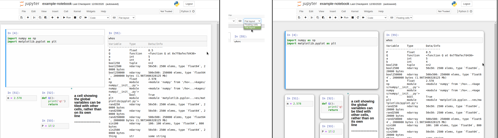
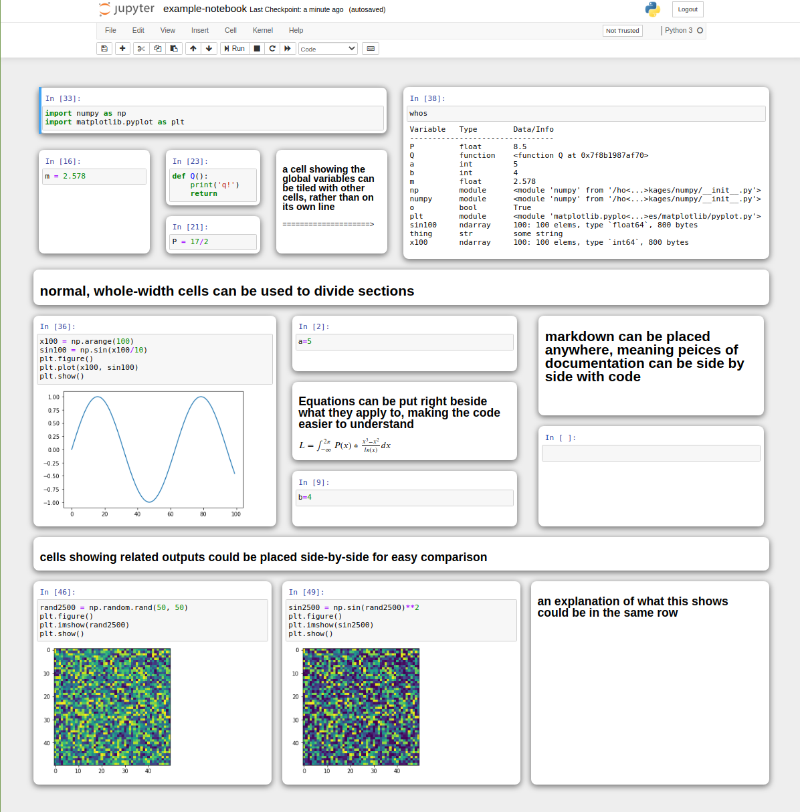
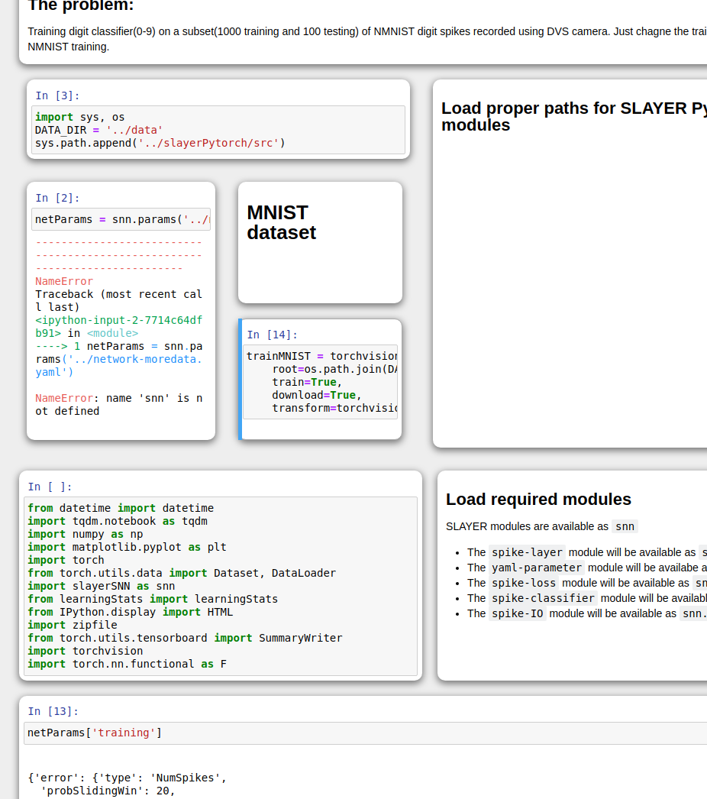
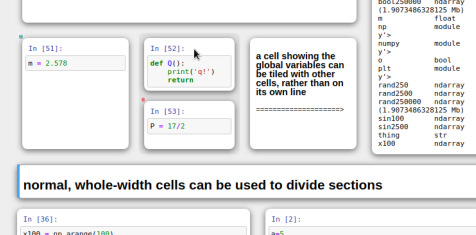

# Jupyter Mosaic

Arrange Jupyter notebook cells in any way two-dimensionally.
Let your Jupyter notebook tell the story and be self-documenting in itself, like a poster presentation.
Eliminate white space in your notebook and take advantage of unused screen real estate.

Jupyter Mosaic is an extension for Jupyter notebook and Jupyter lab that allows cells to be dragged around and resized to tile in a subdividable grid layout.

The layout you define by dragging cells into place is saved in the metadata of the notebook, so anyone with the extension can view the layout as you made it.

Without the extension, your notebook will still function normally as a jupyter notebook, just without the draggable mosaic layout. 

This does not change any of the core functionality of jupyter, just the UI.


Two different styles are offered, and can be switched between with a dropdown menu.




## Installation
 * [Jupyter notebook](#jupyter-notebook)
 * [Jupyter lab](#jupyter-lab)

### Jupyter notebook

We recommend updating conda/jupyter before beginning, because we have found older versions cause `nbextension enable` to fail.

Clone the repository then install and enable the extension:
```bash
git clone https://github.com/robertstrauss/jupytermosaic.git
jupyter nbextension install jupytermosaic/mosaic_notebook --user
jupyter nbextension enable jupytermosaic/mosaic_notebook/main --user
```
You may need to restart the Jupyter notebook server if it was already running.

#### Uninstall

It can be disabled by running this in the directory you cloned the repo at:
```bash
jupyter nbextension disable jupytermosaic/mosaic_notebook/main --user
```
Or uninstalled similarly:
```bash
jupyter nbextension uninstall jupytermosaic/mosaic_notebook --user
```

### Jupyter lab
TODO - Jupyter mosaic does not currently work on Jupyter lab.


## Grid Structrue and Execution Order
A regular Jupyter notebook is a series of cells, each occupying the entire width of the notebook.
In Jupyter Mosaic, the notebook is divided into rows, each of which may contain multiple cells and columns, which may be again divided into rows recursively, and so on and so on.
Each row is executed left-to-right. Each column is executed top-to-bottom.
When a column is inside a row, the column is executed entirely before continuing to the right, and vice versa.

Hovering the mouse over a cell provides a visual indicator of which cell will be executed after this cell and which before (red/blue dot in the corner means after/before respectively). Additionally, the row or column the cell is in is highlighted with a slightly darker background.



This structure is more difficult to explain with words than it is to understand, so some diagrams are provided.


This execution order is also how the cells are linearized when the notebook is opened without the Jupyter Mosaic extension.


## How to cite
Robert Strauss, 2020, https://github.com/robertstrauss/jupytermosaic
