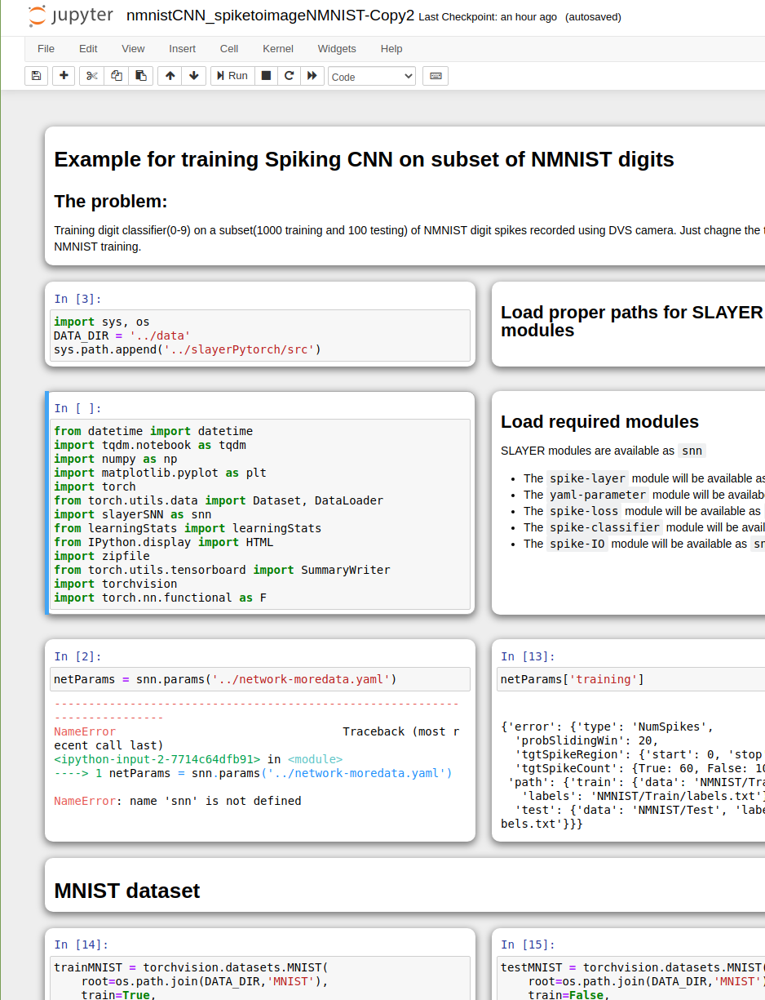

# Jupyter Mosaic
==============

Jupyter Mosaic is an extension for Jupyter notebook and Jupyter lab that allows cells to be dragged around and resized to tile in a subdividable grid layout.

|  |  |

## Installation
===============
 * [Jupyter notebook](#jupyter-notebook)
 * [Jupyter lab](#jupyter-lab)

### Jupyter notebook
(anaconda, bash)

1. Run the following command to install jupyter nbextensions tool, which allows custom notebook extensions to be installed

    ```bash
        pip install jupyter_contrib_nbextensions
    ```

2. Clone this repository into `$CONDA_PREFIX/lib/python[version]/site-packages/jupyter_contrib_nbextensions/nbextensions/`, replacing the parts in brackets as necessary

    ```bash
        cd $CONDA_PREFIX/lib/python[version]/site-packages/jupyter_contrib_nbextensions/nbextensions/
        git clone https://github.com/robertstrauss/jupytermosaic
    ```

3. Finally, install the extension into the home jupyter directory with:

    ```bash
        jupyter contrib nbextensions install --user
    ```


4. Start or restart jupyter notebook

    ```bash
        jupyter notebook
    ```

5. Open the jupyter notebook in a browser and select the 'Nbextensions' tab


6. Uncheck the disable option (if necessary)


7. Check 'Jupyter Mosaic' in the list of extensions to enable it


Done! From now on, when you open a Jupyter notebook it will display using Jupyter Mosaic.


### Jupyter lab
TODO - Jupyter mosaic does not currently work on Jupyter lab.
